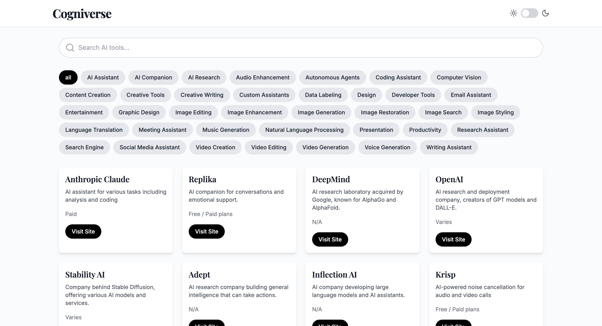

# Cogniverse - AI Tools Collection Hub



Cogniverse is a comprehensive collection of AI tools and platforms, designed to help users discover and explore the latest advancements in artificial intelligence. This web application provides an intuitive interface for browsing, searching, and filtering various AI tools across multiple categories.

## Features

- **Extensive AI Tool Collection**: Browse through a curated list of AI tools and platforms.
- **Category Filtering**: Easily filter tools by categories such as Image Generation, Natural Language Processing, Coding Assistants, and more.
- **Search Functionality**: Quickly find specific tools or explore based on keywords.
- **Responsive Design**: Enjoy a seamless experience across desktop and mobile devices.
- **Dark Mode**: Toggle between light and dark themes for comfortable viewing in any environment.

## Technology Stack

- Next.js
- React
- TypeScript
- Tailwind CSS
- Framer Motion (for animations)

## Getting Started

1. Clone the repository:   ```
   git clone https://github.com/yourusername/cogniverse.git   ```

2. Navigate to the project directory:   ```
   cd cogniverse   ```

3. Install dependencies:   ```
   npm install   ```

4. Run the development server:   ```
   npm run dev   ```

5. Open [http://localhost:3000](http://localhost:3000) in your browser to see the application.

## Project Structure

- `src/app`: Contains the main application pages and layouts.
- `src/components`: Reusable React components.
- `src/types`: TypeScript type definitions.
- `src/mockData.ts`: Mock data for AI tools (replace with API integration in production).

## Screenshot

To add the screenshot to your README:

1. Place the `demo-screenshot.png` file in the root directory of your project.
2. The image will automatically be displayed in the README as shown at the top of this file.

## Contributing

Contributions are welcome! Please feel free to submit a Pull Request.

## License

This project is licensed under the MIT License - see the [LICENSE](LICENSE) file for details.
